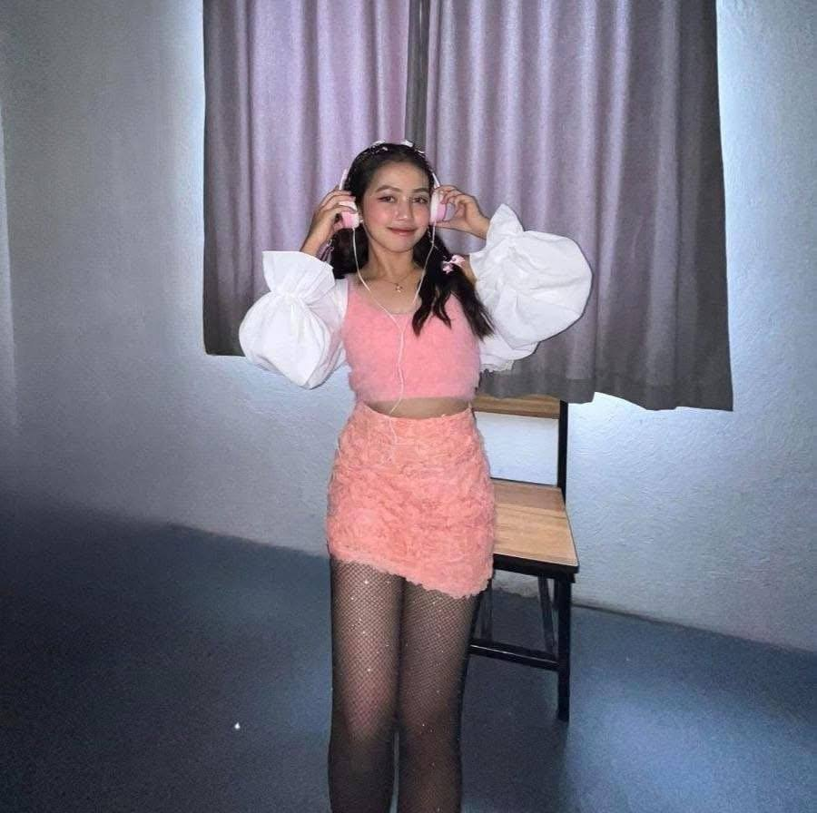

<a name="readme-top">

<br/>

<br />
<div align="center">
  <a href="https://github.com/Chi-Rimando06/">
    
  </a>
  <h3 align="center">WD-Finals</h3>
</div>

<div align="center">
  This project is a fully customized, Netflix-inspired personal website that showcases who I am, what I do, and what I’ve built. It serves as my digital identity and portfolio as a BSIT student focused on web design and development. The website consists of multiple interactive pages with custom styles, animations, and components that reflect my personality, interests, and work.
</div>

<br />


[](https://wakatime.com/badge/user/018dd99a-4985-4f98-8216-6ca6fe2ce0f8/project/63501637-9a31-42f0-960d-4d0ab47977f8)

---

<br />
<br />

<details>
  <summary>Table of Contents</summary>
  <ol>
    <li>
      <a href="#overview">Overview</a>
      <ol>
        <li>
          <a href="#key-components">Key Components</a>
        </li>
        <li>
          <a href="#technology">Technology</a>
        </li>
      </ol>
    </li>
    <li>
      <a href="#rule,-practices-and-principles">Rules, Practices and Principles</a>
    </li>
    <li>
      <a href="#resources">Resources</a>
    </li>
  </ol>
</details>

---

## Overview

This project is a fully customized, Netflix-inspired personal website that showcases who I am, what I do, and what I’ve built. It serves as my digital identity and portfolio as a BSIT student focused on web design and development. The website consists of multiple interactive pages with custom styles, animations, and components that reflect my personality, interests, and work.This project is a fully customized, Netflix-inspired personal website that showcases who I am, what I do, and what I’ve built. It serves as my digital identity and portfolio as a BSIT student focused on web design and development. The website consists of multiple interactive pages with custom styles, animations, and components that reflect my personality, interests, and work.

### Key Components
- MultiPage Website
- Netflix-Inspired Landing Page
- Custom Hover & Animation Effects
- Interactive Carousel and Cards
- Fixed Header and Footer
- Styled Project Gallery with Live Previews
- Social Links & Contact Section
- Cinematic Intro Animations

### Technology


## Rules, Practices and Principles
1. Always use `WD-` in the front of the Title of the Project for the Subject followed by your custom naming.
2. Do not rename any .html files; always use `index.html` as the filename.
3. Place Files in their respective folders.
4. All file naming are in camel case.
   - Camel case is naming format where there is no white space in separation of each words, the first word is in all lower case while the succeding words first letter are in upper followed by lower cased letters.
   - ex.: buttonAnimatedStyle.css
5. Use only `External CSS`.
6. Renaming of Pages folder names are a must, and relates to what it is doing or data it holding.
7. File Structure to follow below.

```
WD-ProjectName
└─ assets
|   └─ css
|   |   └─ style.css
|   └─ img
|   |   └─ fileWith.jpeg/.jpg/.webp/.png
|   └─ js
|       └─ script.js
└─ pages
|  └─ pageName
|     └─ assets
|     |  └─ css
|     |  |  └─ style.css
|     |  └─ img
|     |  |  └─ fileWith.jpeg/.jpg/.webp/.png
|     |  └─ js
|     |     └─ script.js
|     └─ index.html
└─ index.html
└─ readme.md
```

## Resources

| Title | Purpose | Link |
|-|-|-|
| Netflix | Served as the primary design inspiration for the layout, animations, and overall interface of the landing page. | https://www.netflix.com/ph |
| Google Fonts | Used to style the website with custom typography to reflect a modern and readable aesthetic. | https://fonts.google.com/ |
| Canva | Used in designing and exporting my curriculum vitae. | https://www.canva.com |
| Capcut | Used to edit and compile my landing page intro video and project highlight videos. | https://www.capcut.com/ |